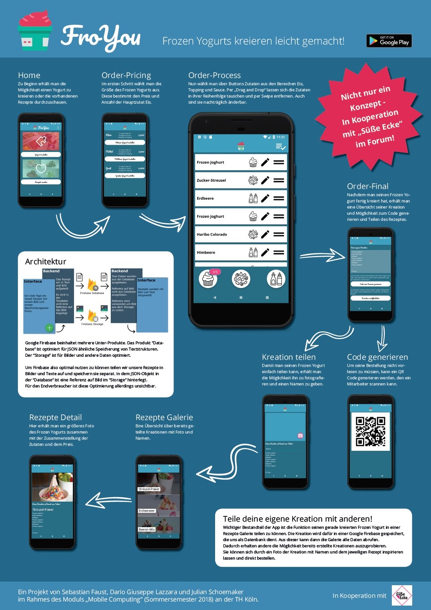

# FroYou

Im Rahmen des Modules [Mobile Computing](https://wiki.moxd.io/display/WPFMoCoSS18/WPF+Mobile+Computing+SS2018+Home) der TH Köln von Sebastian Faust, Julian Schoemaker und Dario Giuseppe Lazzara

Für den Themenbereich “Enterprise” haben wir uns mit dem Unternehmen “Die Süße Ecke” im Gummersbacher Forum zusammengetan und eine App entwickelt die den Bestellprozess von Frozen Yoghurts und Softeis erleichtern soll.

### Features

- Diese App ermöglicht es den Nutzern einen Frozen Yogurt nach Baukasten Prinzip zusammen zu stellen.
- Eigene Kreationen mit anderen Nutzern zu teilen.
- Selbst Rezepte von Freunden auszuprobieren. 
- Bestellung schon auf dem weg zu der Süßen Ecke mit derzeitig im Laden verfügbaren Zutaten zusammenzustellen. 
- Das Bestellen selbst geht eben so einfach. Man zeigt einfach den Generierten QR Code dem Mitarbeiter an der Kasse und wartet bis die Kreation fertig ist.

Dies ist Unser erstes größeres Verteiltes System. Viele sachen sind bei weitem nicht Optimal gelöst und wie das bei jedem Projekt ist würden wir im nachhinein vieles anders Lösen.
Der Lehrerfolg wahr allerding enorm und wir konnten aus diesem Projekt eine Menge für zukünftige Projekte mitnehmen.

## Poster

